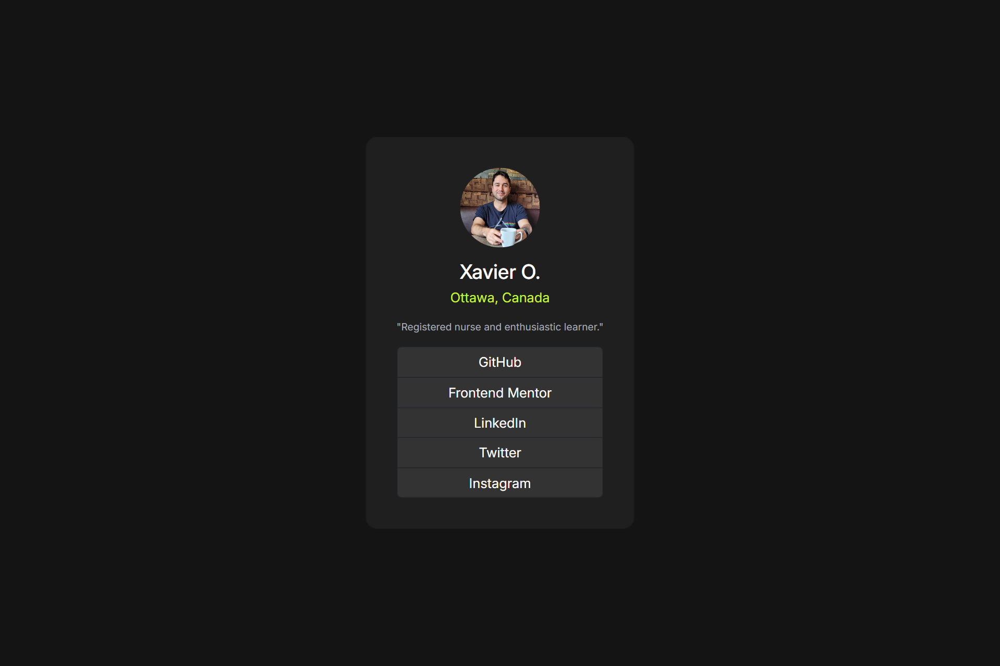

# Frontend Mentor - Social links profile solution

This was built as part of a challenge with Frontend Mentor.

## Table of contents

- [Overview](#overview)
  - [The challenge](#the-challenge)
  - [Screenshot](#screenshot)
  - [Links](#links)
- [My process](#my-process)
  - [Built with](#built-with)
  - [What I learned](#what-i-learned)
  - [Continued development](#continued-development)
  - [Useful resources](#useful-resources)
- [Author](#author)
- [Acknowledgments](#acknowledgments)

## Overview

### The challenge

Users should be able to:

- See hover and focus states for all interactive elements on the page

### Screenshot

### Links

- Solution URL: [Add solution URL here](https://your-solution-url.com)
- Live Site URL: [Add live site URL here](https://your-live-site-url.com)

## My process

### Built with

- Semantic HTML5 markup
- CSS custom properties
- Flexbox
- Bootstrap

### What I learned

I started learning bootstrap today and tried to make this project with as little raw CSS as I could. I made some minor styling change from the challenge template to make it more to my taste and tried setting it up as my landing page for github.

### Continued development

I'll have to change my btn-group-vertical to an ul with the btn as li to be able to get spacing between the btn elements. This is something I will take into consideration as I get more comfortable with Bootstrap.

### Useful resources

- [Example resource 1](https://www.example.com) - This helped me for XYZ reason. I really liked this pattern and will use it going forward.
- [Example resource 2](https://www.example.com) - This is an amazing article which helped me finally understand XYZ. I'd recommend it to anyone still learning this concept.

## Author

- Website - [Add your name here](https://www.your-site.com)

## Acknowledgments

Thank you to the users on Frontend Mentor for their generous and helpful feedback so far.